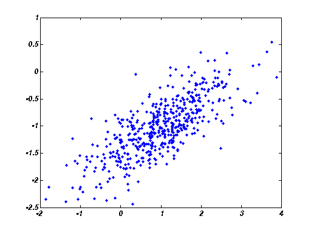
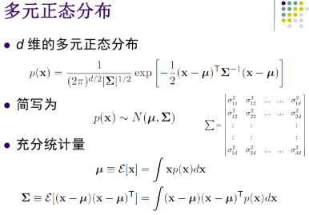
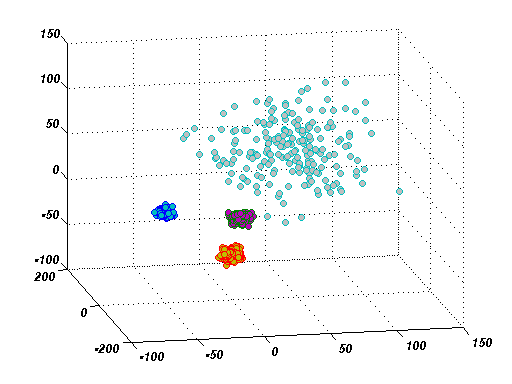
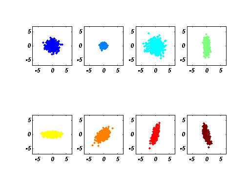

# <center>模式識別</center>

## <center>姓名: 楊瑒</center>

## <center>學號: 11122057</center>
</br>
</br>
# <center>實驗2</center>

## 習題No. 2.1

### * 實驗代碼：

> 以下爲幫助文檔中的示例代碼，mu爲mean vector(均值向量), Sigma爲covariance matrix協方差矩陣

````
mu = [1 -1];
Sigma = [.9 .4; .4 .3];
r = mvnrnd(mu, Sigma, 500);
plot(r(:,1),r(:,2),'.');
````
	
### * 實驗結果截圖：



## 習題No. 2.2

### * 實驗代碼：

> 數學理論：



> 代碼中解釋如下：

````
function val = multi_var_gaussian_probability_density(mu, Sigma, x)
% multi_var_gaussian_probability_density
%   Computes multi-variable Gaussian Probability Density Value.
%   Formular:
%       p(x) ~ N(mu, Sigma) where d is dimension
%       p(x) = 1./((2 * pi) ^(d/2) * det(Sigma) ^ (1./2) ...
%           * exp(-1./2 * (x - mu)' * Sigma^(-1) * (x - mu))
% Input:
%   mu - mean vector of the Gauss distribution
%   Sigma - covariance matrix of the Gauss distribution
%   x - the independent variable of p(x), multi-var Gaussian probability density value
[dimension, ~] = size(mu);

%val = (1/((2*pi) ^ (dimension/2) * det(Sigma) ^ 0.5)) * exp(-0.5 * (x-mu)' * inv(Sigma) * (x-mu));
val = (1/((2 * pi) ^ (dimension/2) * det(Sigma) ^ 0.5)) ...
    * exp(-0.5 * (Sigma \ (x - mu))' * (x - mu));


end
````
	    
### * 實驗結果：

1 *一個簡單的腳本來繪出多維高斯分佈的圖像：*

````
maxn = 5;
minn = -5;
step = 0.5;

x1 = minn:step:maxn;
x2 = minn:step:maxn;
[~, sz] = size(x1);
z = zeros(sz, sz);

icnt = 1;
jcnt = 1;
for i = minn:step:maxn
    jcnt = 1;
    for j = minn:step:maxn
        z(icnt, jcnt) = multi_var_gaussian_probability_density([1;-1], [3 0; 0 3], [i; j]);
        
        jcnt = jcnt + 1;
    end
    icnt = icnt + 1;
end

surf(x1, x2, z)
````

2 *圖像結果*：

* 圖像1：
	


* 圖像2 -- 圖像1的俯視圖：


	
## 習題No. 2.3

### * 實驗代碼：

* 由於書中的代碼是有問題的，它的fix函數會使得`X=[X t]`中的`t`矩陣成爲緯度不固定的矩陣，導致錯誤。

* (注：後來我發現這個`generate_gauss_classes`函數，作者只用在二維中，
所以不會發生`t`的緯度會改變的問題，我寫的以下函數是可以在任意緯度下工作的）

* 根據理解了意圖之後，我使用rand函數來完成對Gauss Distribution的選擇，以使得生成的DataSet符合Probability向量中的生成概率要求。

* 以下爲函數代碼：

````
function [ DataSet, BasedGaussDistIndex ] = generate_gauss_classes(mu, Sigma, Probability, Count)
% BRIEF: generate gauss data set
% `a` is the dimension of your data set, and we are going to make `N` of them
% `c` is the number of `gauss distribution`(s) that we should use
%
% INPUTS:
%    `mu` is  a `c*a` matrix, each row is the mean vector of the ith
% distribution.
%    `Sigma` is a `a*a*c` matrix, each S(:,:,i) is the covariance of the ith
% distribution.
%    `Probability` is a `c*1` vector, representing the corresponding probability
% of ith distribution.
%    `count` is the number of data sets that we are going to generate
%
% OUTPUTS:
%    `DataSet` is a `a*N` matrix, the corresponding data set (every row is
% a data set)
%    `BasedGaussDistIndex` is the index matrix, representing the ith data set
% is generated based on the jth gauss distribution.

if sum(Probability) ~= 1
    error(['The `Probability` vector indicating the probability should'...
    'sum up to 1.0']);
end

[row, column] = size(mu);
DataSet = zeros(Count, column);
BasedGaussDistIndex = zeros(Count, 1);

% Generate the Acucumulated Probability Vector
prob_sz = row;
ProbGenVec = zeros(prob_sz, 1);
accumulated_probability = 0;
for i = 1 : prob_sz
    accumulated_probability = accumulated_probability + Probability(i, 1);
    ProbGenVec(i, 1) = accumulated_probability;
end

% `ith` is a variable storing using of ith Gauss Distribution.
% (Bad design though because of matlab)
ith = 0;

for i = 1 : Count
    % rand to use ith Gauss Distribution
    rnd = rand();
    for j = 1 : prob_sz
        if rnd < ProbGenVec(j, 1)
            ith = j;
            break;
        end
    end

    temp = mvnrnd(mu(ith,:), Sigma(:,:,ith), 1);
    DataSet(i,:) = temp;
    BasedGaussDistIndex(i, 1) = ith;
end

end
````

* 我嘗試用一個簡單的腳本將數據可視化，腳本如下：

````
a = 3;
c = 4;

m = zeros(c, a);
m(1,:) = [-50 0 0];
m(2,:) = [0 -50 0];
m(3,:) = [0 0 -50];
m(4,:) = [50 50 50];

S = zeros(a,a,c);
S(:,:,1) = [10 0 0; 0 10 0; 0 0 10];
S(:,:,2) = [10 0 0; 0 10 0; 0 0 10];
S(:,:,3) = [10 0 0; 0 10 0; 0 0 10];
S(:,:,4) = [1000 0 0; 0 1000 0; 0 0 1000];

P = zeros(c, 1);
P(1) = 0.1;
P(2) = 0.2;
P(3) = 0.5;
P(4) = 0.2;

[X, y] = generate_gauss_classes(m,S,P,1000);
disp('Base: ');
disp(y);
disp('DataSet: ');
disp(X);

g1index = find(y == 1);
g2index = find(y == 2);
g3index = find(y == 3);
g4index = find(y == 4);

g1 = X(g1index, :);
g2 = X(g2index, :);
g3 = X(g3index, :);
g4 = X(g4index, :);

figure
grid on
hold all
scatter3(g1(:,1), g1(:,2), g1(:,3), 'MarkerFaceColor', [0, 0.75, 0.75]);
scatter3(g2(:,1), g2(:,2), g2(:,3), 'MarkerFaceColor', [0.75, 0, 0.75]);
scatter3(g3(:,1), g3(:,2), g3(:,3), 'MarkerFaceColor', [0.75, 0.75, 0]);
scatter3(g4(:,1), g4(:,2), g4(:,3), 'MarkerFaceColor', [0.75, 0.75, 0.75]);
````

### * 實驗最終可視化效果：



* 藍色的點爲g1型，即均值爲`[-50 0 0]`的點。
* 紫色的點爲g2型，即均值爲`[0 -50 0]`的點。
* 橙色的點爲g3型，即均值爲`[0 0 -50]`的點。
* 灰色的點爲g4型，即均值爲`[50 50 50]`的點。
* 另外，藍色、紫色，和橙色的點的協方差都是`[10 0 0; 0 10 0; 0 0 10]`而，灰色的點，我們將其協方差擴大到`[1000 0 0; 0 1000 0; 0 0 1000]`，這樣大家就可以非常顯著地看出他們的差別。

## * 習題No 2.4

### 實驗代碼：

* 由於我的`generate_gauss_classes`是自己重寫的，接口有一點點不一樣。
* 這個和習題2.3中，我用來可視化的代碼差不多，所以沒什麼問題，也不用太多加說明。
* 另外，書上的代碼有小小的一點點性能問題，所以我稍微改動了一下

````
function hw24_plot_data(DataSet, BasedGaussDistIndex, mu)
    [N, col] = size(DataSet);
    [c, ~] = size(mu);

    if c > 6
        disp(['Warning: This function supports only a maximum'...
        'of 6 gauss dist classes']);
        disp('We will draw the first 6 classes');
    end

    pale = ['r.'; 'g.'; 'b.'; 'y.'; 'm.'; 'c.'];

    g1index = find(BasedGaussDistIndex == 1);
    g2index = find(BasedGaussDistIndex == 2);
    g3index = find(BasedGaussDistIndex == 3);
    g4index = find(BasedGaussDistIndex == 4);
    g5index = find(BasedGaussDistIndex == 5);
    g6index = find(BasedGaussDistIndex == 6);

    g1 = DataSet(g1index, :);
    g2 = DataSet(g2index, :);
    g3 = DataSet(g3index, :);
    g4 = DataSet(g4index, :);
    g5 = DataSet(g5index, :);
    g6 = DataSet(g6index, :);

    figure(1);
    % plot the DataSet
    hold on
    plot(g1(:, 1), g1(:, 2), 'r.');
    plot(g2(:, 1), g2(:, 2), 'g.');
    plot(g3(:, 1), g3(:, 2), 'b.');
    plot(g4(:, 1), g4(:, 2), 'y.');
    plot(g5(:, 1), g5(:, 2), 'm.');
    plot(g6(:, 1), g6(:, 2), 'c.');

    % plot the `mu`
    plot(mu(:, 1), mu(:, 2), 'k + ')
end
````

* 以下是driver script:
````
a = 2;
c = 6; % maximum is 6 because of colors

m = zeros(c, a);
m(1,:) = [-50 0];
m(2,:) = [0 -50];
m(3,:) = [0 0];
m(4,:) = [50 0];
m(5,:) = [0 50];
m(6,:) = [50 50];

S = zeros(a,a,c);
S(:,:,1) = [10 0; 0 10];
S(:,:,2) = [10 0; 0 10];
S(:,:,3) = [100 0; 0 100];
S(:,:,4) = [10 0; 0 10];
S(:,:,5) = [10 0; 0 10];
S(:,:,6) = [10 0; 0 10];

P = zeros(c, 1);
P(1) = 0.1;
P(2) = 0.4;
P(3) = 0.1;
P(4) = 0.2;
P(5) = 0.1;
P(6) = 0.1;

[X, y] = generate_gauss_classes(m,S,P,5000);
disp('Base: ');
disp(y);
disp('DataSet: ');
disp(X);

hw24_plot_data(X, y, m);
````

### * 實驗效果圖：


* 和前面習題2.3的可視化一樣，我將其中的一個的協方差調整的比較大，這樣，可以看出不同。


## 習題 2.5

### * 實驗代碼：

````
function result = bayes_classifier(mu, Sigma, Probability, DataSet)
% BRIEF: Use Bayes Classifier to classify DataSet
%
% `a` is the dimension of your data set
% `c` is the number of `gauss distribution`(s) that we should use
% 
% INPUTS:
%    `mu` is  a `c*a` matrix, each row is the mean vector of the ith
% distribution.
%    `Sigma` is a `a*a*c` matrix, each S(:,:,i) is the covariance of the ith
% distribution.
%    `Probability` is a `c*1` vector, representing the corresponding probability
% of ith distribution.
%    `DataSet` is a `a*N` matrix, the input DataSet,
% each row contains one sample data

    [N, ~] = size(DataSet);
    [c, ~] = size(mu);

    t = zeros(1, c);
    result = zeros(1, N);
    
    for i = 1 : N
        for j = 1 : c
            t(j) = Probability(j) * mvnpdf(DataSet(i, :), mu(j, :), Sigma(:,:,j));
        end
        [~, result(i)] = max(t);
    end
end
````

### * 自動化腳本：

````
a = 3;
c = 4;

m = zeros(c, a);
m(1,:) = [-50 0 0];
m(2,:) = [0 -50 0];
m(3,:) = [0 0 -50];
m(4,:) = [50 50 50];

S = zeros(a,a,c);
S(:,:,1) = [10 0 0; 0 10 0; 0 0 10];
S(:,:,2) = [10 0 0; 0 10 0; 0 0 10];
S(:,:,3) = [10 0 0; 0 10 0; 0 0 10];
S(:,:,4) = [1000 0 0; 0 1000 0; 0 0 1000];

P = zeros(c, 1);
P(1) = 0.1;
P(2) = 0.2;
P(3) = 0.5;
P(4) = 0.2;

[X, y] = generate_gauss_classes(m,S,P,1000);

ret = bayes_classifier(m, S, P, X);

disp('sum(abs(bayes_classifer_result - answer)): ');
disp(sum(abs(ret' - y)));
````

### * 實驗結果：

````
sum(abs(bayes_classifer_result - answer)): 
     0
````

* 我相信畫一張和習題2.3一樣的圖片已經沒什麼太大意思了，大家也看不出什麼不同
* 我做的事情是這樣的，我拿Bayes分類器做出來的結果和原先用來生成的Based Gauss Distribution Index相減（爲了抵消正負我做了絕對值）
* 得到的結果爲0，就很能說明問題，這個驗證實驗是成功的，成功用Bayes算法找到了原本使用的Gauss Distribution。

## 習題 1.3.1

### * 實驗代碼：

````
m = [0 1]';
S = eye(2);
X1 = [0.2 1.3]';
X2 = [2.2 -1.3]';
pg1 = multi_var_gaussian_probability_density(m, S, X1);
pg2 = multi_var_gaussian_probability_density(m, S, X2);
disp(pg1);
disp(pg2);
````

### * 實驗結果：

````
    0.1491

    0.0010
````

## 習題 1.3.3

### * 實驗代碼：

````
N = 500;
m = [0 0];
S = zeros(2,2,8);
DataSet = zeros(N, 2, 8);

S(:,:,1) = [1.0  0.0;  0.0 1.0];
S(:,:,2) = [0.2  0.0;  0.0 0.2];
S(:,:,3) = [2.0  0.0;  0.0 2.0];
S(:,:,4) = [0.2  0.0;  0.0 2.0];
S(:,:,5) = [2.0  0.0;  0.0 0.2];
S(:,:,6) = [1.0  0.5;  0.5 1.0];
S(:,:,7) = [0.3  0.5;  0.5 2.0];
S(:,:,8) = [0.3 -0.5; -0.5 2.0];

cc = jet(8);
figure(1);
hold on;
for i = 1 : 8
    DataSet(:,:,i) = mvnrnd(m, S(:,:,i), N);
    subplot(2, 4, i);
    plot(DataSet(:,1,i), DataSet(:,2,i), '.', 'color', cc(i,:));
    axis equal;
    axis([-7 7 -7 7]);
end

````

### * 實驗效果圖：



* 由於方便描述，我們將Sigma矩陣標誌爲`[a b; c d]`形式，a爲x1和自己的協方差（即x1的方差），b和c爲x1和x2的協方差，d爲x2和自己的協方差（即x2的方差）
* 從形象化的角度來看：
    * a和d的值越大，數據就越分散，反之就越密集
    * a和d分別操縱着x軸和y軸的離散度，即a越大的時候x方向上的點就越分散，反之則越密集，同理可得d。
    * b和c操控着以b(c)的斜率方向上的點的密集程度（b=c!=0）
* 通俗的來講：
    * 方差，就是自己和自己的相聯繫程度的大小，方差越大，自己和自己的聯繫程度越小。
    * 協方差，就是A和B之間的聯繫程度的大小，協方差越大，兩者的關係越密切，這將使得點集更多地聚集在以協方差爲斜率的直線上
    
## 習題 1.3.4

### * 實驗代碼：

````
Prob = [0.5 0.5];
mu = [1 1; 3 3];
Sig = zeros(2,2,2);
Sig(:,:,1) = [1 0; 0 1];
Sig(:,:,2) = [1 0; 0 1];

x = [1.8 1.8];

disp('mu1:'); disp(mu(1,:));
disp('mu2:'); disp(mu(2,:));
disp('Sigma1:'); disp(Sig(:,:,1));
disp('Sigma2:'); disp(Sig(:,:,2));
disp('x: '); disp(x);

fprintf('----------\n');
ret = bayes_classifier(mu, Sig, Prob, x);
disp('Probability: '); disp(Prob);
fprintf('Class: %i\n', ret);
fprintf('----------\n');

Prob = [1/6 5/6];
ret = bayes_classifier(mu, Sig, Prob, x);
disp('Probability: '); disp(Prob);
fprintf('Class: %i\n', ret);
fprintf('----------\n');

Prob = [5/6 1/6];
ret = bayes_classifier(mu, Sig, Prob, x);
disp('Probability: '); disp(Prob);
fprintf('Class: %i\n', ret);
fprintf('----------\n');
````

### * 實驗結果：

````
mu1:
     1     1

mu2:
     3     3

Sigma1:
     1     0
     0     1

Sigma2:
     1     0
     0     1

x: 
    1.8000    1.8000

----------
Probability: 
    0.5000    0.5000

Class: 1
----------
Probability: 
    0.1667    0.8333

Class: 2
----------
Probability: 
    0.8333    0.1667

Class: 1
----------
````

### * 實驗結果的啓示：

* 先驗概率，正比地影響着，在同等結果的條件下，使用生成之條件的概率。

* 在我們使用的Bayes算法中，我們分別求出了`使用第i種類型，且生成的數據是x`的概率密度，即`P(A[i], x)`。

* 由於，`P(A[i]|x) = P(A[i], x)/p(x)`，所以，`P(A[i]|x)`正比於`P(A[i], x)`

* 同時，`P(A[i],x) = p(x|A[i]) * P(A[i])`，所以，`P(A[i], x)`正比於`P(A[i])`


# <center>實驗3</center>

### * 實驗代碼：

````
function [params] = nbayes_learn(traindata, trainlabels)

nclasses = 2;
[n, d] = size(traindata);

% Estimate class probabilities and conditional probabilities  
for i=1:nclasses
    index = find(trainlabels==i);

    data_ci = traindata(index,:);
    ni = size(index, 1);

    params(1).classprobs(i) = ni/n;  % estimate the probability of class i 

    for j = 1:d 
        data_jcol = data_ci(:,j);
        for k=1:2
            data_k = find(data_jcol == k);
            % estimate prob(variable j = k | class i)
            params(j).cprobs(k,i) = (size(data_k, 1) + 0.5)/(ni + 1);
        end
    end
end
 
% Estimate the probabilities p(x_j = value_k)
for j = 1:d 
    for k=1:2; 
        index = find(traindata(:,j)==k);
        % estimate  prob(variable x_j = k)
        params(j).mprobs(k) = size(index, 1)/n;
    end
end
 
end
````

````
function [predictions] = nbayes_predict(params, testdata)

nclasses = 2;
[ntest, d] = size(testdata);

predictions = zeros(ntest, 1);

% for each of the test data points
for m=1:ntest
    x = testdata(m,:);
    predict_prob = zeros(1,2);
    % for each class value calculate log[ p(x|c) p(c) ]
    for classi=1:nclasses; 
        pci = params(1).classprobs(classi);
        for varj=1:d 
            predict_prob(classi) = predict_prob(classi) ...
                + log(params(varj).cprobs(x(1,varj), classi));
        end
        predict_prob(classi) = predict_prob(classi) + log(pci);
    end
    % select the maximum value over all classes as the predicted class
    % store the class prediction for each test data point 
    [~, predictions(m)] = max(predict_prob);
end

end
````
### * 自動化腳本：

````
features_mat = dlmread('spam_features.txt');
labels_mat = dlmread('spam_labels.txt');

[row, ~] = size(labels_mat);
trainamount = floor(row/2);

traindata = features_mat(1:trainamount, :);
trainlabels = labels_mat(1:trainamount, :);
testdata = features_mat(trainamount+1:row, :);
testlabels = labels_mat(trainamount+1:row, :);

params = nbayes_learn(traindata, trainlabels);
predictions = nbayes_predict(params, testdata);

temp = abs(predictions - testlabels);
rate = sum(temp)/size(temp, 1);

fprintf('Training Data size = %d\n', trainamount);
fprintf('Accuracy = %f\n', 1-rate);
````
### * 實驗結果：

````
Training Data size = 2300
Accuracy = 0.884833
````

# <center>實驗4</center>

## * 實驗 4.1

### * 實驗代碼重要部分解釋：

````
sampleSize = size( Data.samples, DOWN );
maxNorm    = realmin;
for iObservation = 1:sampleSize
    observationNorm = norm( Data.samples(iObservation,:) );
    if observationNorm > maxNorm
        maxNorm = observationNorm;
    end
end
enclosingBallRadius        = maxNorm;
enclosingBallRadiusSquared = enclosingBallRadius .^ 2;

````

* 這部分是爲了求出離原點最遠的點，用來給出bias的修正值，以防梯度下降法無法收斂

````
maxNumSteps = 1000;

for iStep = 1:maxNumSteps

    isAnyObsMisclassified = false;

    for iObservation = 1:sampleSize;

        inputObservation = Data.samples( iObservation, : );
        desiredLabel     = Data.labels(  iObservation    ); % +1 or -1

        perceptronOutput = sum( Model.weights .* inputObservation, ACROSS ) + Model.bias;
        margin           = desiredLabel * perceptronOutput;

        isCorrectLabel   = margin > 0;

        % -------------------------------------------------------------
        % If the model misclassifies the observation, update the
        % weights and the bias.
        %

        if ~isCorrectLabel

            isAnyObsMisclassified = true;

            weightCorrection = desiredLabel  * inputObservation;
            Model.weights    = Model.weights + weightCorrection;

            biasCorrection   = desiredLabel .* enclosingBallRadiusSquared;
            Model.bias       = Model.bias   + biasCorrection;

            displayPerceptronState( Data, Model );

        end % if this observation misclassified.

    end % loop over observations

    if ~isAnyObsMisclassified
        disp( 'Done!' );
        break;
    end

end % outer loop
````

* 以上代碼爲感知器算法的核心
* 其中`perceptronOutput = sum( Model.weights .* inputObservation, ACROSS ) + Model.bias;`計算了`g(x) = w'*x+w0`
* 其中`desiredLabel  * inputObservation;`是`g(x)`中`w`矩陣的修正值
* 其中`desiredLabel .* enclosingBallRadiusSquared;`是`g(x)`中`w0`的修正值
* 多次迭代直至最後沒有分錯的點爲止（或者到1000次）

## 實驗 4.2

### LS.m代碼分析：

````
m(:,1)=[0 0 0 0 0]';
m(:,2)=[1 1 1 1 1]';
S=[.9 .3 .2 .05 .02; 
     .3 .8 .1 .2 .05;
     .2 .1 .7 .015 .07; 
     .05 .2 .015 .8 .01; 
     .02 .05 .07 .01 .75];
P=[1/2 1/2];
````
* 此段爲設置題目要求的Gauss Distribution的mean和covariance

````
% Generate X1 and the required class labels
N1=200;
randn('seed',0)
X1=[mvnrnd(m(:,1),S,fix(N1/2)); mvnrnd(m(:,2),S,N1-fix(N1/2))]';
z1=[ones(1,fix(N1/2)) 2*ones(1,N1-fix(N1/2))];

% Generate X2 and the required class labels
N2=200;
randn('seed',100)
X2=[mvnrnd(m(:,1),S,fix(N2/2)); mvnrnd(m(:,2),S,N2-fix(N2/2))]';
z2=[ones(1,fix(N2/2)) 2*ones(1,N2-fix(N2/2))];
````

* 這一段爲生成X1,X2
* 爲了數據的可再現，代碼中還使用了固定的隨機數種子

````
% Compute the Bayesian classification error based on X2
S_true(:,:,1)=S;
S_true(:,:,2)=S;
[z]=bayes_classifier(m,S_true,P,X2);
err_Bayes_true=sum(z~=z2)/sum(N2)
````

* 這一段使用了bayes算法進行分類，並計算了它的正確率

````
% 2. Augment the data vectors of X1 
X1=[X1; ones(1,sum(N1))];
y1=2*z1-3;

% Augment the data vectors of X2
X2=[X2; ones(1,sum(N2))];
y2=2*z2-3;

````

* 這一段將 `X1`, `X2` 增廣化

````
% Compute the classification error of the LS classifier based on X2
[w]=SSErr(X1,y1,0);
SSE_out=2*(w'*X2>0)-1;
err_SSE=sum(SSE_out.*y2<0)/sum(N2)
````

* 這一段使用X1對SSE算法進行訓練，使用它對X2進行分類，並計算了正確率

### SSErr.m代碼分析：

````
[l,N]=size(X);
w=inv(X*X'+C*eye(l))*(X*y');
````

* SSE本質上就只做了`a = inv(Y'*Y)*Y'*b`這個公式的事情，求得的解，即爲分類

## * 實驗 4.3

### * 代碼分析：

````
% This example deals with 2 classes
c1=[1 2;2 3;3 3;4 5;5 5]  % the first class 5 observations
c2=[1 0;2 1;3 1;3 2;5 3;6 5] % the second class 6 observations
scatter(c1(:,1),c1(:,2),6,'r'),hold on;
scatter(c2(:,1),c2(:,2),6,'b');

% Number of observations of each class
n1=size(c1,1)
n2=size(c2,1)

%Mean of each class
mu1=mean(c1)
mu2=mean(c2)
````

* 生成數據，計算各自的mean

````
% Center the data (data-mean)
d1=c1-repmat(mu1,size(c1,1),1)
d2=c2-repmat(mu2,size(c2,1),1)

% Calculate the within class variance (SW)
s1=d1'*d1
s2=d2'*d2
sw=s1+s2
invsw=inv(sw)

% in case of two classes only use v
 v=invsw*(mu1-mu2)'
````

* d1的計算即，`x(j)-m1`的公式，d2同理
* s1就是原公式中的前半部分，`sum((x(j)-m1)(x(j)-m1)')`，s2也同理
* sw爲類內散度矩陣
* invsw爲sw的逆矩陣
* 由`w`正比於`inv(sw) * (m2-m1)`得到代碼中的`v`

````
% project the data of the first and second class respectively
y2=c2*v
y1=c1*v
````

* 完成對`c1`, `c2`的投影

# <center>實驗5</center>

